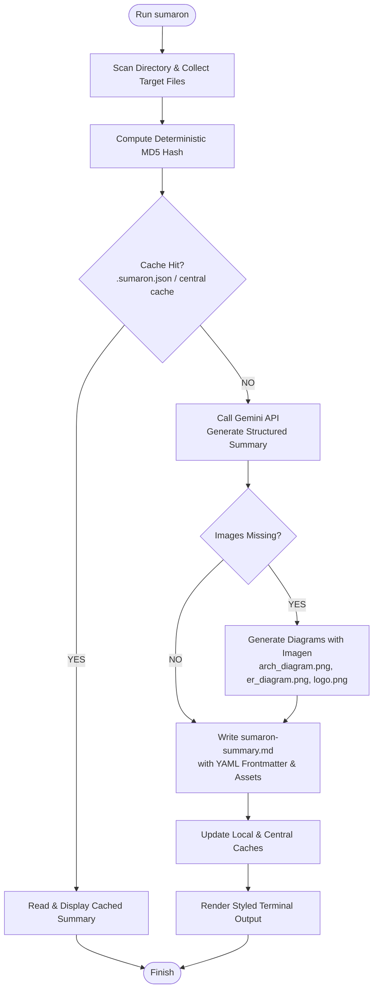

# SUMARON 🐴👁️

<p align="center">
  
</p>

> **The Big Donkey of Folder Summarization** 🌋🐴  
> *Fast, cache-efficient directory summarizer powered by Google Gemini and Imagen.*

The name **Sumaron** is a humorous pun and homage to *"Il signore dei Tarzanelli"* (the legendary Lord of the Rings parody/revival in Ferrarese dialect): *"Sumar"* means donkey (*somaro* / *sumàr*) in the Ferrarese/Emilian dialect, and *"-on"* is the augmentative suffix ("Big Donkey"), which phonetically doubles as **Sauron**, the Dark Lord of Mordor.

---

## What Sumaron Does 🚀

`sumaron` inspects, hashes, and summarizes any project folder or codebase using Google Gemini. Because LLM processing takes time and API quota, Sumaron is built around **strict, dual-layer caching** and automated visual documentation.

### Key Capabilities

1. **📁 Smart Directory Scanning**:
   - Recursively walks target directories and gathers text-based documentation and source files (defaults: `.md`, `.html`, `.json`).
   - Configurable recursion depth (`--max-depth`) and file limit capping (`--max-files`) to prevent overwhelming context limits.

2. **⚡ Deterministic Two-Tier Caching**:
   - Computes a deterministic MD5 hash across all sorted file contents and paths.
   - Checks both local folder cache (`.sumaron.json`) and a central user registry (`~/.sumaron-cache.json`).
   - On a cache hit, returns the existing summary instantly without making repeated LLM API calls.

3. **🧠 AI-Powered Summarization**:
   - Sends file contents to Google Gemini (`gemini-flash-latest` by default).
   - Generates an executive summary, architecture overview, and structured file breakdown.

4. **🎨 Automated Visual Architecture & Branding**:
   - Automatically generates project diagrams and logos using Google Imagen (see examples generated directly for this repository: [`assets/logo.png`](assets/logo.png), [`assets/arch_diagram.png`](assets/arch_diagram.png), and [`assets/er_diagram.png`](assets/er_diagram.png)).
   - Seamlessly embeds visual assets into markdown summaries (`sumaron-summary.md`).

5. **📄 Standardized Output**:
   - Writes `sumaron-summary.md` with complete YAML frontmatter (version, date, file list, asset links, model details).
   - Prints styled, colorful terminal output using Lip Gloss.

---

## Architecture & Workflow Diagram 🏗️

<p align="center">
  
</p>



---

## Quick Start ⚡

### Installation

```bash
# Build and install to ~/bin
just build
just install
```

### Usage

Ensure `GEMINI_API_KEY` is set in your environment:

```bash
export GEMINI_API_KEY="your-gemini-api-key"

# Summarize the current folder
sumaron

# Summarize a specific directory
sumaron --folder /path/to/project

# Customize extensions, depth, and file count
sumaron -f . -e ".go,.md,.proto" --max-depth 3 --max-files 50

# Bypass cache and force re-summarization
sumaron --force
```

For complete documentation on all flags, environmental variables, and caching internals, see the [User Manual](docs/USER_MANUAL.md).

